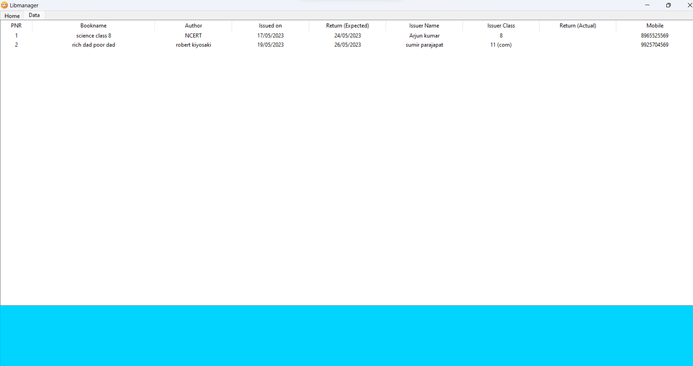
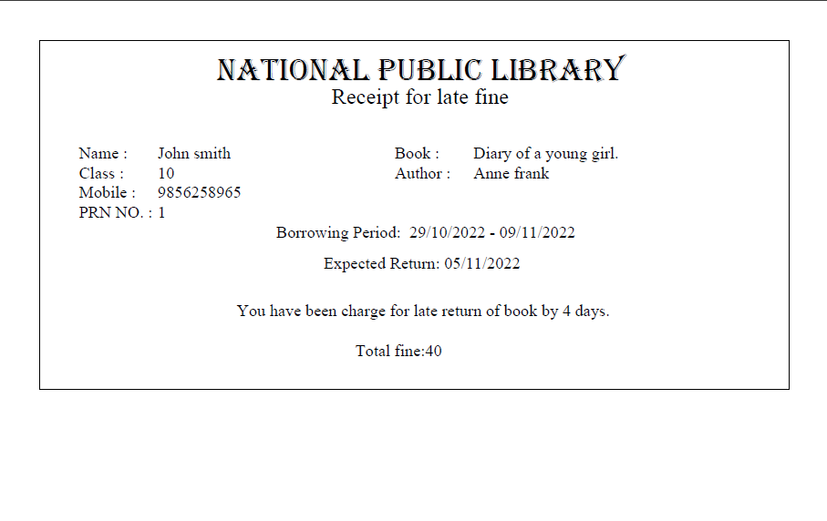

# LIBMANGER: library management software 📚 

LIBMANAGER is a library management software which ease the taking record of books borrowers. It fully automates the record taking and receipt generating tasks. It is very easy to use and best application for schools, colleges and public libraries.

This project is open source and written in python tkinter module.

## Project Overview 📸
some screenshots of the projects.

- Home window

- data window 

- receipt (pdf)


## Getting Started 💁

After downloading this project open XAMPP and start the APACHE server and MYSQL. Then open cmd in project directory and write the following command.

```cmd
    start requirements.py
```
This command only be runs once on the computer where the project is installed. This will install all the dependencies of the project and also create the database and table for the project.

After this command to start the project write following command.
```cmd
    start app.py
```

## About files 📁

### Requirements.py
This file is the most important as this file is like a setup file of the project. This is run once file it means this should be runs only one time on the machine and it will download all the dependencies for the project.

### App.py
This file contain all the frontend elements of the project.

### Function_uitilities.py
This file contain all the functionality of the project. This file is responsible for working of buttons and connection to database. 


### Note
To ensure the smooth working of LIBMANAGER ensure that your computer has installed Algerian font, else install it from following site.
https://fontsgeek.com/fonts/Algerian-Regular

## Authors

- [@Gitanshu](https://www.github.com/Gitax18)
